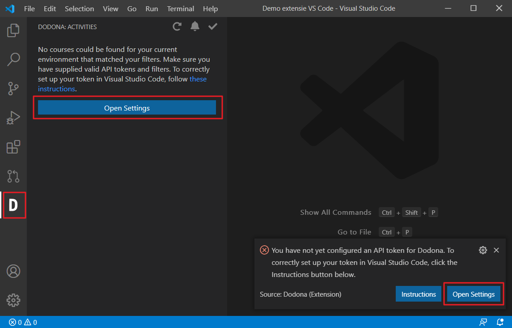
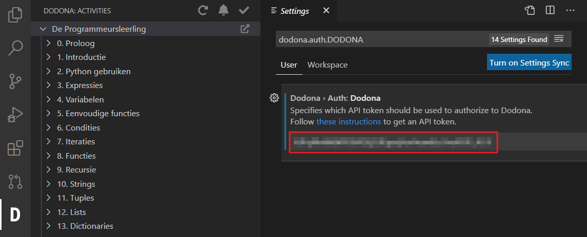
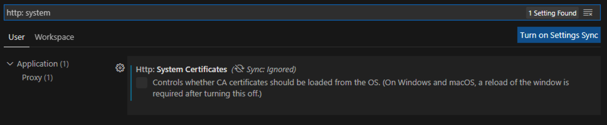
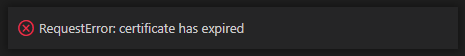
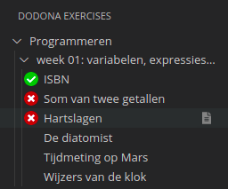
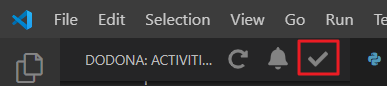
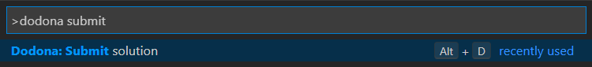
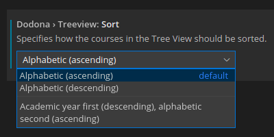
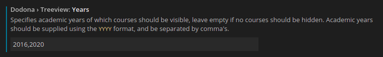
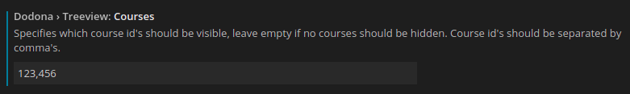

# Dodona

[](https://marketplace.visualstudio.com/items?itemName=thepieterdc.dodona-plugin-vscode)
[](https://marketplace.visualstudio.com/items?itemName=thepieterdc.dodona-plugin-vscode)
[](https://codecov.io/gh/thepieterdc/dodona-plugin-vscode)

Extension for Visual Studio Code to submit exercises to [Dodona](https://dodona.be/).

## Install the Dodona extension

1.  Extensions (`Ctrl+Shift+X`)
2. Search for **Dodona**
3. `Install`

## Insert API token (Configuration)

You can authenticate by creating an API token. Using such token, VS Code can submit your solution on your behalf without needing your password. Instructions on how to do so can be found [here](https://dodona-edu.github.io/guides/creating-an-api-token/). After you have generated a token, configure it in the settings (`Ctrl+,` > `dodona.auth.dodona`):

1.  Dodona icon in the Activity Bar (icon in left column)
2. `Open Settings`
   
3. Paste the API token you just made in text box.
4. In the left column you get an overview of the exercises and series of the course (expand it if necessary).
   

## Disable `Http: System Certificates` on Windows

In order to allow the connection with Dodona on Windows, you have to disable the `Http: System Certificates` in the Visual Studio Code settings as illustrated below.



Skipping this step will result in an error: `RequestError: certificate has expired`.



## Creating new exercises via Dodona extension (Usage)

1.  Dodona icon in the Activity Bar (icon in left column).
2. Select your course, series, and exercise in the tree.
3. Left-click on an exercise to open it in the editor. In the settings (`dodona.exercise.description.auto`) you can adjust if you want to open the activity description at the same time or not.
4. VS Code will now automatically create a new file in which you can write your solution.



The first line of the newly created file will contain the link to the selected exercise as a comment. The Dodona extension uses this line to submit to the correct exercise, so don't remove it. If you hold `ctrl` (or `cmd` on a mac) while clicking the URL, the exercise description will open in a new browser window.

> **Example**
>
> ```javascript
> // https://dodona.be/nl/activities/1545120484/
> function echo(i) {
>     return i;
> }
> ```

## Submit exercises via Dodona extension (Usage)

Once you've solved the exercise, it's easy to submit your solution. There are three ways to submit a solution:

-   Click the checkmark (  ) in the left panel with the Dodona activities.
-   You can also use the `Alt+D` shortcut (`Option-D` for Mac users) for this, or assign a [different shortcut](https://code.visualstudio.com/docs/getstarted/keybindings#_keyboard-shortcuts-editor).
-   Another option is to execute the `Dodona: Submit solution`-command by opening the command palette using `Ctrl+Shift+P` and typing (parts of) `Dodona: Submit solution` and pressing `Enter`.

This command will submit your code to Dodona and trigger an automatic test.

After a few seconds, you should see a popup in the bottom right corner containing the result of your submission. If you click the `View results` button, the result with the difference between your output and the expected output should open in a new browser window.

## Other functionality

|                                    Symbol                                     | Meaning                                                                                                                                                          |
| :---------------------------------------------------------------------------: |:-----------------------------------------------------------------------------------------------------------------------------------------------------------------|
|               | Reload the list of activities.                                                                                                                                   |
|     | Notifies users in case of unread feedback. The icon links to https://dodona.be/notifications.                                                                    |
|   | Submit solution to Dodona. Alternative for `Alt+D` and `Ctrl+Shift+P`, `Dodona: Submit Solution`.                                                                |
|                     | Opens the description of a series or course in a new browser window. (Hover with your cursor over a series or course in the left column with Dodona activities.) |
|  | Show the exercise description in VS Code. (Hover with your cursor over an exercise in the left column with Dodona activities.)                                   |

## Sorting and filtering courses (Usage)

You can change the order in which courses are shown using the `dodona.treeview.sort` dropdown in the settings. By default, this will be set to sort by `Alphabetic (ascending)`. Courses are always sorted by `Academic Year (descending)` primarily, so that your most recent courses are always on top of the list.



When subscribed to a lot of courses, it can often become difficult to find the relevant ones. In case you are a teacher, it could also happen that you want to give a presentation to your students, but don't want to flash your exams and tasks in the sidebar.

You can apply filters to _only_ show courses of certain academic years, or courses with certain id's, by using the `dodona.treeview.courses` and `dodona.treeview.years` fields. Both of these filters can be applied _at the same time_, and they will count as an **AND** filter, meaning that only courses meeting both filters will be shown.

Academic years should be supplied using the `YYYY` format, and be separated by comma's. For example, to only show courses from `2016-2017` and `2020-2021`, you would use `2016,2020`.



Course ids can be found at the end of a course's URL, and should be separated by commas. For example, to only show courses with ids `123` and `456`, you would use `123,456`.



To show _all_ courses or remove your filters, you can just leave the fields blank (default).

## Credits

-   Extension initially developed by [Pieter De Clercq](https://thepieterdc.github.io/)
-   Functionality vastly extended by [Stijn De Clercq](https://github.com/stijndcl)
