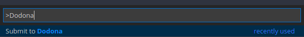

# Dodona

[](https://marketplace.visualstudio.com/items?itemName=thepieterdc.dodona-plugin-vscode)
[](https://marketplace.visualstudio.com/items?itemName=thepieterdc.dodona-plugin-vscode)

Extension for Visual Studio Code to submit exercises to [Dodona](https://dodona.ugent.be/).

## Install the Dodona extension

1.  Extensions (`Ctrl+Shift+X`)
2. Search for **Dodona**
3. `Install`

## Insert API token (Configuration)

You can authenticate by creating an API token. Instructions on how to do so can be found [here](https://dodona-edu.github.io/guides/creating-an-api-token/). After you have generated a token, configure it in the settings:

1.  Cogwheel (icon in bottom left corner), Settings (`Ctrl+,`)
2. `Extensions` (last item in list), `Dodona`
3. Paste the API token in text box.


## Submit exercises via Dodona extension (Usage)

Add the Dodona url of the exercise in VS Code as a comment on the **first line** of your solution.

> **Example**
>
> ```javascript
> // https://dodona.ugent.be/nl/activities/1545120484/
> function echo(i) {
>     return i;
> }
> ```

Execute the `Submit to Dodona`-command by opening the command palette using `Ctrl-Shift-P` by typing (parts of) `Submit to Dodona` and pressing `Enter`.  You can also make a [shortcut](https://code.visualstudio.com/docs/getstarted/keybindings#_keyboard-shortcuts-editor) for this.



## Credits

- Extension initially developed by [Pieter De Clercq](https://thepieterdc.github.io/).

